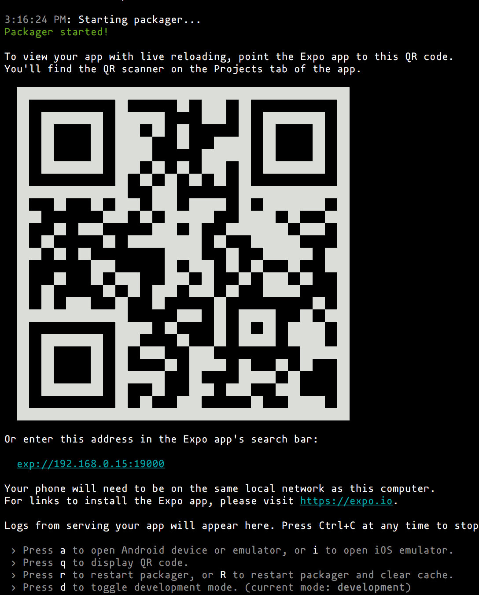

# Instalação das ferramentas

## Debian e derivados

**Node.js** e **npm** (utilizando [`nvm`](https://github.com/creationix/nvm))

```bash
curl -o- https://raw.githubusercontent.com/creationix/nvm/v0.33.8/install.sh | bash
export NVM_DIR="$HOME/.nvm"
[ -s "$NVM_DIR/nvm.sh" ] && \. "$NVM_DIR/nvm.sh"  # This loads nvm
[ -s "$NVM_DIR/bash_completion" ] && \. "$NVM_DIR/bash_completion"  # This loads nvm bash_completion
nvm install node
node --version
npm --version
```

**yarn** (opcional)

```bash
curl -sS https://dl.yarnpkg.com/debian/pubkey.gpg | sudo apt-key add -
echo "deb https://dl.yarnpkg.com/debian/ stable main" | sudo tee /etc/apt/sources.list.d/yarn.list
sudo apt-get update
sudo apt-get install yarn
echo "export PATH=\"\$PATH:\`yarn global bin\`\"" >> ~/.bashrc
```

**create-react-native-app**

Com yarn:

```bash
yarn global add create-react-native-app
```

Ou com npm:

```bash
npm install --global create-react-native-app
```

**Configuração**

```bash
echo "fs.inotify.max_user_instances=1024" | sudo tee -a /etc/sysctl.conf
echo "fs.inotify.max_user_watches=12288" | sudo tee -a /etc/sysctl.conf
```

> Você precisará reiniciar a máquina para configuração fazer efeito.

### Testando a configuração

```bash
create-react-native-app hello-world
cd hello-world
yarn start # ou npm run start
```

Você deve ver um QRCode, como por exemplo:



 
## Editores de código e IDE

### [VSCode (recomendado)](https://code.visualstudio.com/)


```bash
curl https://packages.microsoft.com/keys/microsoft.asc | gpg --dearmor > microsoft.gpg
sudo mv microsoft.gpg /etc/apt/trusted.gpg.d/microsoft.gpg
sudo sh -c 'echo "deb [arch=amd64] https://packages.microsoft.com/repos/vscode stable main" > /etc/apt/sources.list.d/vscode.list'
sudo apt-get update
sudo apt-get install code
```

### [Atom](https://atom.io/)


