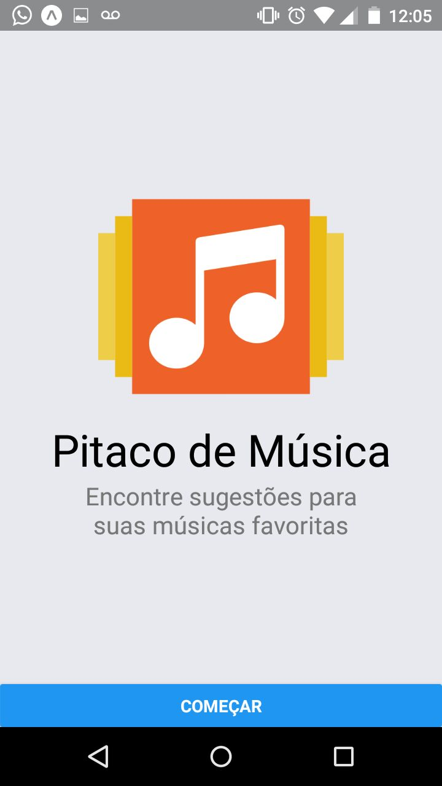

# Minicurso React-Native [:page_facing_up:](#)

Repositório oficial do minicurso de React-Native promovido pelo **C**élula **A**cadêmico de **De**senvolvimento de **S**oftware (CADES) e o Google Developer Group Natal (@gdg-natal) no [GDG Natal Meeting #12](https://www.meetup.com/pt-BR/GDG-Natal/events/246850875/).

## Apresentação

- PDF
- Google Docs

## Prática

#### Instalação

Antes de começar, você vai precisar:

* Node.js
* `npm` ou yarn
* create-react-native-app

Para mais instruções, [INSTALL.md](INSTALL.md).

### Passo 0 - Iniciar projeto [:arrow_upper_right:](https://github.com/cades-ifrn/minicurso-react-native-gdg-natal/tree/step-0)

- [ ] `create-react-native-app pitaco-de-musica`
- [ ] `cd pitaco-de-musica`
- [ ] `yarn add react-navigation`
- [ ] `yarn start`

### Passo 1 - Adicionar React-Navigation [:arrow_upper_right:](https://github.com/cades-ifrn/minicurso-react-native-gdg-natal/tree/step-1)

- [ ] Criar componente HomeScreen
- [ ] Utilizar componente `StackNavigator`

### Passo 2 - Criar tela de início [:arrow_upper_right:](https://github.com/cades-ifrn/minicurso-react-native-gdg-natal/tree/step-2)

- [ ] Utilizar componente `Image`
- [ ] Utilizar componente `ScrollView`
- [ ] Utilizar componente `Button`
- [ ] Estilizar componentes

### Passo 3 - Navegar entre telas [:arrow_upper_right:](https://github.com/cades-ifrn/minicurso-react-native-gdg-natal/tree/step-3)

- [ ] Criar componente SearchScreen
- [ ] Adicionar SearchScreen no navegador raiz
- [ ] Adicionar evento para realizar navegação

### Passo 4 - Pesquisar e Apresentar Resultados [:arrow_upper_right:](https://github.com/cades-ifrn/minicurso-react-native-gdg-natal/tree/step-4)

- [ ] Utilizar componente `FlatList`
- [ ] Criar componente Header
- [ ] Criar componente Item
- [ ] Carregar resultados

### Passo 5 - Estilização e APIs [:arrow_upper_right:](https://github.com/cades-ifrn/minicurso-react-native-gdg-natal/tree/step-5)

- [ ] Utilizar `Alert API`
- [ ] Estilizar resultados

### Passo 6 - Exploração [:arrow_upper_right:](https://github.com/cades-ifrn/minicurso-react-native-gdg-natal/tree/step-6)

- [ ] Adicionar exploração

## Instrutores

|  |  |
| ----- | ----- |
| [Felipe Pontes](//github.com/felipemfp) | [Francisco Bento](//github.com/chicobentojr) |

## Apoio

|  |  |
| --- | --- |
| Instituto Federal do Rio Grande do Norte Campus Natal-Central Diretoria Acadêmica de Gestão e Tecnologia da Informação | GDG Natal |
